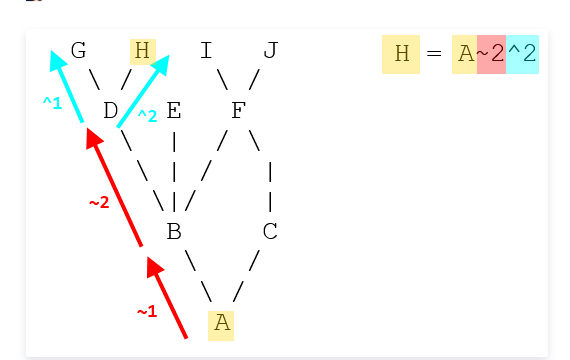

```bash
git checkout --track origin/branch_name
git add . -a
git remote origin set-url [url]
git remote rm origin
git remote add origin [url]
git pull origin other_branch
git pull --rebase origin other_branch
git add .
git rebase --continue
git rebase --skip
git rebase --abort
git pull origin master --allow-unrelated-histories
git push --set-upstream origin
```


```bash
ga .
gcmsg "dfsdfsd"
git rebase -i Head~n

```
### Head~ 与 Head^的区别

波浪~线在外观上几乎是线性的，并且想沿直线向后走，插入符号^表示一棵有趣的树段或道路上的一个岔路口
