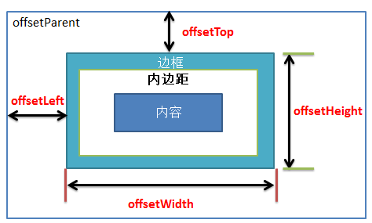
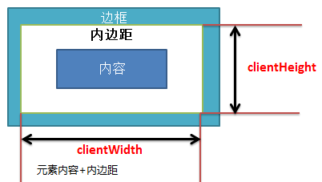
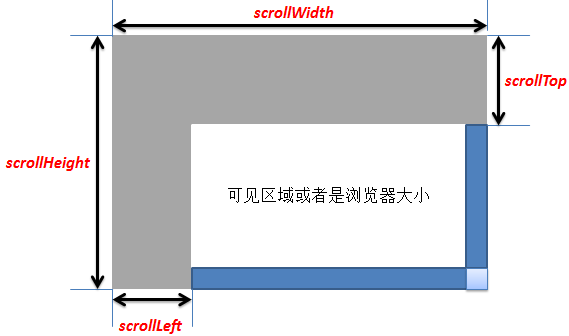

### offsetHeight offsetWidth offsetLeft offsetTop
+ offsetWidth/offsetHeight 元素内容+padding+border
+ offsetTop/offsetLeft 与offsetParent左上的距离
+ offsetParent 元素最近的定位祖先元素


获取某一元素在文档中的位置
```javascript
function getElementPosition(e) {
    let x = 0, y = 0;
    while(e != null) {
        x += e.offsetLeft;
        y += e.offsetTop;
        e = e.offsetParent;
    }
    return { x: x, y: y };
}
```

### clientWidth clientHeight innerWidth innerHeight
+ clientWidth/clientHeight 元素内容+padding
+ window.innerWidth/window.innerHeight 浏览器窗口的视口大小（如果有滚动条则包含)



### scrollHeight scrollWidth scrollLeft scrollTop
+ scrollHeight/scrollWidth 该元素在不使用滚动条的情况下为了适应视口中所用内容所需的最小高度。没有垂直滚动条的情况下，scrollHeight值与元素视图填充所有内容所需要的最小值 clientHeight相同。包括元素的padding，但不包括元素的border和margin。scrollHeight也包括 ::before 和 ::after这样的伪元素。
+ scrollLeft/scrollTop 读取或<strong>设置</strong>元素滚动条到元素左边/上边的距离
+ window.pageXOffset/window.pageYOffset 窗口滚动的距离



获取窗口滚动条的位置
```javascript
function getScrollPosition() {
    var supportPageOffset = window.pageXOffset !== undefined;
    var isCSS1Compat = ((document.compatMode || "") === "CSS1Compat");

    var x = supportPageOffset ? window.pageXOffset : isCSS1Compat ? document.documentElement.scrollLeft : document.body.scrollLeft;
    var y = supportPageOffset ? window.pageYOffset : isCSS1Compat ? document.documentElement.scrollTop : document.body.scrollTop;
    return {x, y}
}
```