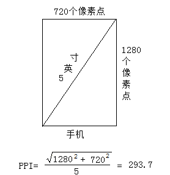
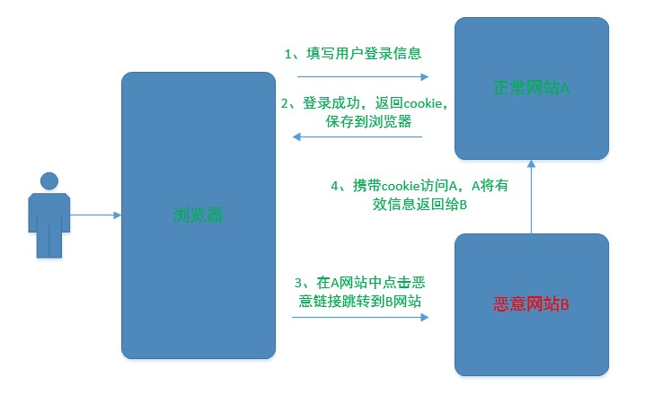
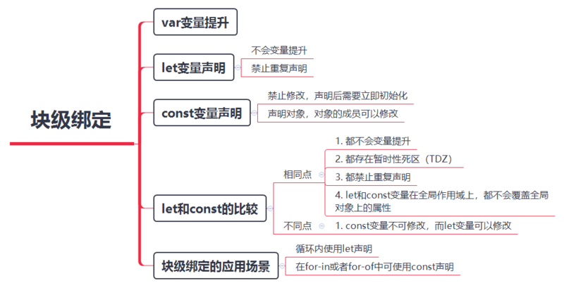

+ js forEach 函數是sync的，传入的参数有current，倘若要想修改currentValue,当是一个对象时，修改currentValue同样会影响array，但当currentValue是数字或字符串时，需要通过array[index]修改.
+ Date 
    + getDate 方法返回的是1-31
    + getMonth 方法返回的是0-11
+ 函数是一种对象 Function instanceof Object === true
+ scope、Execution Context（执行环境）描述是基于函数的;context是基于对象this，箭头函数的this其实就是在定义的时候就确定好的，以后不管怎么调用这个箭头函数，箭头函数的this始终为定义时的this，箭头函数没有arguments
+ https原理 关键点 数字证书：服务器的相关信息+加密方式+私钥加密数字签名（证书编号），浏览器对证书上的服务器信息使用约定的加密算法加密后与解密后的证书编号比对.
+ 没有一种告别是完美的，我们生命当中所有的重要的告别都是突如其来的，珍惜现实，珍惜当下，珍惜身边所有美好的一切，用完美的心态面对不完美的告别。from 极限挑战
+ 人生就是不断地放下，然而还没来得及好好的告别。from 极限挑战
+ 进程是资源分配的基本单位，线程是运算调度的基本单位，一个进程可以拥有多个线程，各个线程共享进程资源，进程之间都有独立的资源，js是单线程的，所以不存在争夺资源。适合IO密集型操作
+ IO密集型操作：比如涉及到网络、磁盘读写；计算密集型操作：计算圆周率、视频解码等
+ 用户的编程模型是单进程单线程的，NodeJS进程本身是多线程的
+ TCP面向连接、可靠的如：http、https、Ftp、SMTP;UDP是无连接的，尽最大努力交付如：直播、语音
+ Typescript 中的类型、值；class C {} 会产生一个类型（指的它的实例结构）和一个值（指向它的构造函数）
+ UMD模块实际是CMD和AMD的结合
+ 当你设置document.cookie = 'test=123'时，仅仅是会话cookie，<strong>浏览器关闭后cookie消失</strong>，过期时间可能是1969-12-31T23:59:59.000Z，至少在chrome表现是这样
+ transform: translateZ(0); 在做动画特效时来开启硬件加速
+ input标签在type=number时maxlength不会起作用
+ String replace 方法的第一个参数为正则表达式时，$n将<strong>正则表达式匹配到的字符串用捕获组代替</strong>
+ IOS 的input的disabled会自动添加样式，可以用readonly属性代替
+ 正则表达式中'-'中有在字符集[]中才有意义，'.'在字符集中无意义，只单纯表示'.'
+ vue 中input的value可以通过v-model或者手动修改$ref.value达到实时更新
+ vue 中$refs在computed或watch中不能使用，可以使用Vue.nextTick
+ var a = [] a[7] = 8 now a.length === 8预检
+ CORS post时 content-type:'application/json' 属于非简单请求需要预检；当服务器端设置Credentials：true时客户端同样需要设置，并且Access-Control-Allow-Origin不允许为"*"
+ round 平铺 repeat 重复，平铺会改变原来元素大小；重复则按照元素本身填充，边界不足时hidden
+ 变换函数是通过数学上的矩阵乘法运算完成的，而矩阵的乘法是不满足交换律的。任意坐标空间内的变换函数或者变换函数的组合，都可以转换为一个矩阵
+ transform-style: preserve-3d;保证所有子元素都处于同一个三维空间，即三维渲染上下文3D rendering context
+ 常规属性left、top，甚至margin-left等，是先生效的，它们的效果其实只有一个，就是改变元素的初始位置，从而改变元素的transform-origin的那个原点位置，然后三维空间的transform是后生效的，它会再基于前面的transform-origin继续改变位置。
+ box-shadow 在透明情况下可能不能如你所愿，可以用filter兼容
+ svg 的viewBox相当于建立一个单独的用户坐标系，之后的transform变换都是在这个坐标系基础上，preserveAspectRatio控制视图的展示，类似background-image-size属性类似
+ background-attachment 针对background-image的，与background-color无关
+ backgroung-position 背景图会从当前位置开始，逐步变化，平铺。。。
+ http协议应用层，get put应该遵从幂等性，post 不遵循
### 菲茨法则
任意一点移动到目标中心位置所需时间与该点到目标的距离和大小有关，距离越大时间越长，目标越大时间越短。
```javascript
T = a + b log2(D/W + 1)
// T=移动设备所需时长；a,b是经验常量，D=设备起始位置和目标位置中心的距离；W=目标的宽度大小
```
### css 选择器
```javascript
.a + .b {
  // 匹配紧接在.a之后的.b 且同级（之匹配一个）
}
.a ~ .b {
    // 匹配.a 之后的所有同级.b
}
li:first-child:nth-last-child(n+4)::nth-last-child(n+6), li:first-child:nth-last-child(n+4)::nth-last-child(n+6) ~ li {
    // 列表包含4-6个列表项时，命中所有列表项
}
```
### defer async
    defer：并行加载，执行要在所有元素解析完成之后，DOMContentLoaded 事件触发之前完成。
    async：并行加载，加载完之后立即执行

### load DOMContentLoaded page
    DOMContentLoaded：当初始的 HTML 文档被完全加载和解析完成之后，DOMContentLoaded 事件被触发，而无需等待样式表、图像和子框架的完成加载。注意：DOMContentLoaded 事件必须等待其所属script之前的样式表加载解析完成才会触发。
    load：当一个资源及其依赖资源已完成加载时，将触发load事件。
    pageshow：当一条会话历史记录被执行的时候将会触发页面显示(pageshow)事件。(这包括了后退/前进按钮操作，同时也会在onload 事件触发后初始化页面时触发)
```javascript
<script>
  window.addEventListener("load", function(event) {
    console.log("所有资源都加载完毕");
  });
</script>
```
[参考链接](https://developer.mozilla.org/zh-CN/docs/Web/Events/DOMContentLoaded)
### Blob 转 File
```javascript
var blob = new Blob(byteArrays, { type: contentType });
var file = new File([blob], filename, {type: contentType, lastModified: Date.now()});

var file = new File([byteArrays], filename, {type: contentType, lastModified: Date.now()});
```
### 几种height的区别
+ clientHeight: 包括padding但不包括border、水平滚动条的高度、margin(可以通过 CSS height + CSS padding - 水平滚动条高度 (如果存在)来计算)
+ offsetHeight: 包括padding、border、滚动条的高度、但不包括margin
+ scrollHeight: clientHeight + 滚动部分
+ scrollTop: 向下滚动的距离
+ offsetTop: 一个元素的 scrollTop 值是这个元素的顶部到它的最顶部可见内容（的顶部）的距离的度量。
+ window.innerWidth: 浏览器视口的宽度，包含滚动条
+ window.outerWidth: 浏览器整体的宽度，包括侧边栏
+ HTMLElement.offsetTop: 距离当前元素父元素顶部border的值
> 滚动条的高度是包括在height里边
+ :last-child 代表在一群兄弟元素中的最后一个元素并且是指定的类型
+ :last-of-type 代表在一群兄弟元素中的指定类型的最后一个元素
+ void 关键字 执行后面的表达式并返回undefined javascript: void 0
### DPI PPI 分辨率 屏幕大小 英寸
    DPI：每英寸显示点的个数
    PPI：每英寸最多拥有的像素数。仅用来描述屏幕的显示能力
    分辨率：描述像素信息，比如1920*1080 宽1920个像素 高1080个像素
    屏幕大小：屏幕尺寸是按照屏幕的对角线来计算的，以英寸为单位
    1英寸约等于2.54cm


### CSS 层叠上下文（stacking context）
满足以下任一条件的元素，会形成新的层级上下文，新的层级上下文默认z-index:0。<strong>子元素的 z-index 值只在父级层叠上下文中有意义。子级层叠上下文被自动视为父级层叠上下文的一个独立单元。</strong>
+ 根元素html
+ z-index不为auto的绝对/相对定位
+ z-index不为auto的flex项目即父元素display:flex|inline-flex
+ opacity小于1或transform不为none
+ 等等
[详情细节](https://developer.mozilla.org/zh-CN/docs/Web/Guide/CSS/Understanding_z_index/The_stacking_context)
[介绍](https://developer.mozilla.org/en/CSS/Understanding_z-index/Stacking_and_float)
### 浏览器渲染
提高动画的优化不得不提及浏览器是如何渲染一个页面。在从服务器中拿到数据后，浏览器会先做解析三类东西：

+ 解析html,xhtml,svg这三类文档，形成dom树。
+ 解析css，产生css rule tree。
+ 解析js，js会通过api来操作dom tree和css rule tree。

解析完成之后，浏览器引擎会通过dom tree和css rule tree来构建rendering tree：

+ rendering tree和dom tree并不完全相同，例如：<head></head>或display:none的东西就不会放在渲染树中。
+ css rule tree主要是完成匹配，并把css rule附加给rendering tree的每个element。

在渲染树构建完成后，

+ 浏览器会对这些元素进行定位和布局，这一步也叫做reflow或者layout。
+ 浏览器绘制这些元素的样式，颜色，背景，大小及边框等，这一步也叫做repaint。
+ 然后浏览器会将各层的信息发送给GPU，GPU会将各层合成；显示在屏幕上。
### generator函数
+ 跟状态机很像，generator函数总是返回一个遍历器对象
+ async 其实就是generator函数的语法糖，await类似yield
### delete 删除属性
```javascript
// 当属行为引用类型时需要先赋值为null
instances[id] = null;
delete instances[id];
```
### 根据ip区分内网外网
以下属于内网
1：10.*.*.*
2：172.16.*.*至172.31.*.*
3：192.168.*.* （*为0到255之间的任意数字）
### for in 遍历对象自身及原型链上的不重复的可枚举属性
```javascript
let a = {
  x: 1
};
function People() {
  this.name = "1";
}
People.prototype = {
  tel: "2"
};
let b = new People();

for (let i in a) {
  console.log(i);
  // x
}
for (let i in b) {
  console.log(i);
  //name tel
}

Object.defineProperty(a, "y", {
  enumerable: true,
  configurable: false,
  writable: false,
  value: "2"
});
for (let i in a) {
  console.log(i);
  // x y
}
Object.defineProperty(a, "z", {
  enumerable: false,
  configurable: false,
  writable: false,
  value: "3"
});
for (let i in a) {
  console.log(i);
  // x y
}
let c = {};
let d = Object.create(null);
console.log(c.__proto__, d.__proto__);
// {} undefined

function H() {
  this.n = "1";
}
H.prototype = {
  h: "h"
};
function P() {
    this.p = 'p'
}
P.prototype = new H()

let e = new P()
for(let i in e) {
    console.log(i)
    // p n h
}
```

### Number
```javascript
Number('') 0
Number(undefined) NaN
Number(false) 0
Number(null) 0
Number('123') 123
Number('123a') NaN
Number({}) NaN
```
### try catch setTimeout Promise
```javascript
function testB() {
    try {
        setTimeout(() => {
            throw Error('444')
        },3000)
    } catch (error) {
        console.log('555555')
    }
}
function testB() {
    try {
        new Promise(res => {
            setTimeout(() => res(1), 3000)
        }).then(res => {
           throw Error(res)
       })
    } catch (error) {
        console.log('555555')
    }
}
// try catch 并不能捕获，但promise 的async await 写法可以更加可控一些
```
### switch case 比较使用的是 ===
```javascript
let a = 1
switch(a) {
    case '1':
    console.log(222);
    break;
    default:
    console.log(333)
}// 333
```
### Proxy拦截属性
```javascript
var person = {
  name: "张三"
};

var proxy = new Proxy(person, {
  get: function(target, property) {
      // 如果对象具有该属性
    if (property in target) {
      return target[property];
    } else {
      throw new ReferenceError("Property \"" + property + "\" does not exist.");
    }
  }
});
```
### 禁止浏览器缓存
html中
```html
<meta http-equiv="Cache-Control" content="no-cache, no-store, must-revalidate" />
<meta http-equiv="Pragma" content="no-cache" />
<meta http-equiv="Expires" content="0" />
```
response
```javascript
response.setHeader("Cache-Control", "no-cache, no-store, must-revalidate");
response.setHeader("Pragma", "no-cache");
response.setHeader("Expires", 0);
```
### 判断一个对象是不是数组
```javascript
    function isArray(value) {
      return Object.prototype.toString().apply(value) === '[object array]';
    };
```
### JSONP
    JSONP只能发送get请求，JSONP原理是创建script，因为script只能get请求
JSON劫持：
    用户A已经登录www.test.com网站，当用户信息仍然有效时，在网站浏览时点击恶意链接跳转到www.bbbb.com下，该页面中有恶意script代码`<script src='//www.test.com/jsonp'>` 借用之前的cookie请求数据

预防
    
    1、refer 白名单
    2、session中的随机数token
    3、JSON Web Token

XSS漏洞:
    callback参数过滤，防止类似情形 `callback=<script>fff</script>`



### let var const
    TDZ: 在当前作用域内，在声明变量之前的区域叫临时死区
```javascript
if (true) {
  //这块区域是TDZ，访问a会报错
  let a = 1
}
```

```javascript
let x = 0
function test() {
    let x = 1
    for(let x = 0; x < 4; x++);
    if(true) {
        let x = 3
    }
    // 不会报错
}

function test(x) {
    // let x = 1
    for(let x = 0; x < 4; x++);
    // 不会报错
}

function test(x) {
    let x = 1
    // 报错
}
```
### class 内的方法都定义到prototype
```javascript
class People {
    test() {

    }
}
// 等同于
let People = function () {
}
People.prototype.test = function () {}
```
### pm2 配置文件
```javascript
{
  "apps": [{
      "name": "wuwu",                             // 项目名          
      "script": "./bin/www",                      // 执行文件
      "cwd": "./",                                // 根目录
      "args": "",                                 // 传递给脚本的参数
      "interpreter": "",                          // 指定的脚本解释器
      "interpreter_args": "",                     // 传递给解释器的参数
      "watch": true,                              // 是否监听文件变动然后重启
      "ignore_watch": [                           // 不用监听的文件
          "node_modules",
          "logs"
      ],
      "exec_mode": "cluster_mode",                // 应用启动模式，支持fork和cluster模式
      "instances": 4,                             // 应用启动实例个数，仅在cluster模式有效 默认为fork；或者 max
      "max_memory_restart": 8,                    // 最大内存限制数，超出自动重启
      "error_file": "./logs/app-err.log",         // 错误日志文件
      "out_file": "./logs/app-out.log",           // 正常日志文件
      "merge_logs": true,                         // 设置追加日志而不是新建日志
      "log_date_format": "YYYY-MM-DD HH:mm:ss",   // 指定日志文件的时间格式
      "min_uptime": "60s",                        // 应用运行少于时间被认为是异常启动
      "max_restarts": 30,                         // 最大异常重启次数，即小于min_uptime运行时间重启次数；
      "autorestart": true,                        // 默认为true, 发生异常的情况下自动重启
      "cron_restart": "",                         // crontab时间格式重启应用，目前只支持cluster模式;
      "restart_delay": "60s"                      // 异常重启情况下，延时重启时间
      "env": {
         "NODE_ENV": "production",                // 环境参数，当前指定为生产环境 process.env.NODE_ENV
         "REMOTE_ADDR": "爱上大声地"               // process.env.REMOTE_ADDR
      },
      "env_dev": {
          "NODE_ENV": "development",              // 环境参数，当前指定为开发环境 pm2 start app.js --env_dev
          "REMOTE_ADDR": ""
      },
      "env_test": {                               // 环境参数，当前指定为测试环境 pm2 start app.js --env_test
          "NODE_ENV": "test",
          "REMOTE_ADDR": ""
      }
  }]
}
```