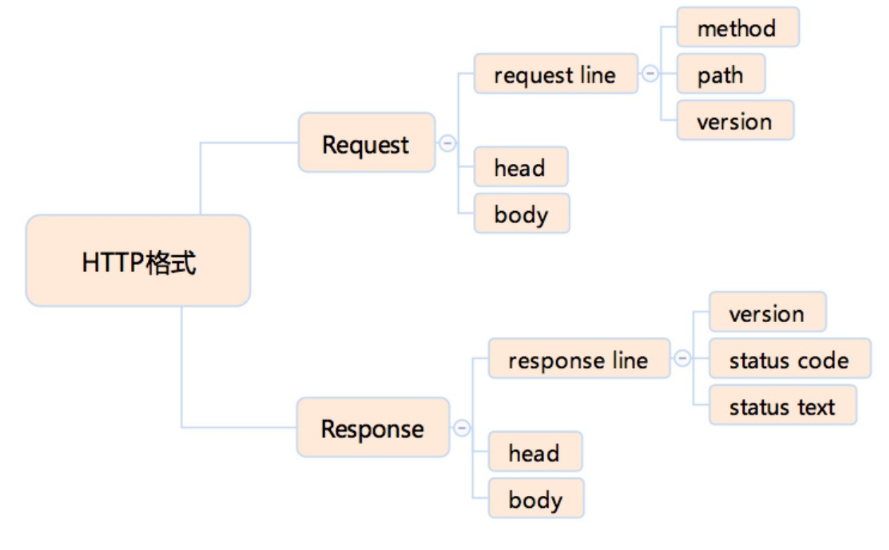

## 基于对象or面向对象
实际上 JavaScript 对象的运行时是一个“属性的集合”，属性以`字符串或者 Symbol` 为 key，以`数据属性特征值或者访问器属性特征值`为 value。
## javascript对象分类
任何对象只需要实现 [[call]]，它就是一个函数对象，可以去作为函数被
调用。而如果它能实现 [[construct]]，它就是一个构造器对象，可以作为构造器被调用。

例如，Number既可以当函数使用，也可以new Number对象

 [[construct]] 的执行过程如下（即new的过程）；
1. 以 Object.protoype 为原型创建一个新对象；
2. 以新对象为 this，执行函数的 [[call]]；
3. <strong>如果 [[call]] 的返回值是对象，那么，返回这个对象，否则返回第一步创建的新对象。</strong>

```javascript
function cls(){
 this.a = 100;
 return {
  getValue:() => this.a
 }
}
var o = new cls;
o.getValue(); //100
//a 在外面永远无法访问到
```
## 浏览器相关
http协议

HTTPS 有两个作用，一是确定请求的目标服务端身份，而是
保证传输的数据不会被网络中间节点窃听或者篡改。

HTTP2.0 最大的改进有两点，一是支持服务端推送、二是支持 TCP 连接复用。
## CSS计算
选择器的出现顺序，必定跟构建
DOM 树的顺序一致。这是一个 CSS 设计的原则，即保证选择器在 DOM 树构建到当前节
点时，已经可以准确判断是否匹配，不需要后续节点信息。
也就是说，未来也不可能会出现“父元素选择器”这种东西，因为父元素选择器要求根据当
前节点的子节点，来判断当前节点是否被选中，而父节点会先于子节点构建。

主流浏览器一般根据 position、transform 等属性来决定合成策略，来“猜测”这些
元素未来可能发生变化。
但是，这样的猜测准确性有限，所以新的 CSS 标准中，规定了 `will-change 属性，可以
由业务代码来提示浏览器的合成策略`，灵活运用这样的特性，可以大大提升合成策略的效
果

## meta标签
一般的 meta 标签由 name 和 content 两个属
性来定义。name 表示元信息的名，content 则用于表示元信息的值。
```html
<!--具有 charset 属性的 meta -->
<meta charset="UTF-8" >

<!-- 具有 http-equiv 属性的 meta-->
<meta http-equiv="content-type" content="text/html; charset=UTF-8">
<!--
  content-language 指定内容的语言；
    default-style 指定默认样式表；
  refresh 刷新；
  set-cookie 模拟 http 头 set-cookie，设置 cookie；
  x-ua-compatible 模拟 http 头 x-ua-compatible，声明 ua 兼容性；
  content-security-policy 模拟 http 头 content-security-policy，声明内容安全策略
  -->
```

## javascript执行
JavaScript 语言，那么采纳 JSC 引擎的术语，我们把宿主发起的任
务称为宏观任务，把 JavaScript 引擎发起的任务称为微观任务。

括号有个缺点，那就是如果上一行代码不写分号，括号会被解释为上一行代码最末
的函数调用，产生完全不符合预期，并且难以调试的行为，加号等运算符也有类似的问
题。所以一些推荐不加分号的代码风格规范，会要求在括号前面加上分号。

```js
;(function(){
 var a;
 //code
}())
;(function(){
 var a;
 //code
})()
```
call、bind 和 apply 用于不接受 this 的函数类型如箭头、class 都不会报错。
这时候，它们无法实现改变 this 的能力，但是可以实现传参。

JavaScript 标准定义了 [[thisMode]] 私有属性。
[[thisMode]] 私有属性有三个取值
+ lexical：表示从上下文中找 this，这对应了箭头函数。
+ global：表示当 this 为 undefined 时，取全局对象，对应了普通函数。
+ strict：当严格模式时使用，this 严格按照调用时传入的值，可能为 null 或者
undefined
