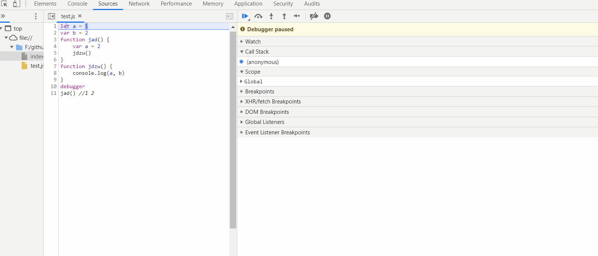
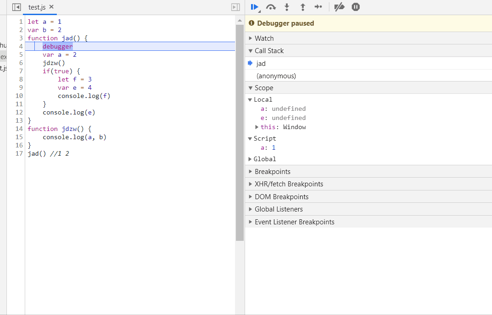
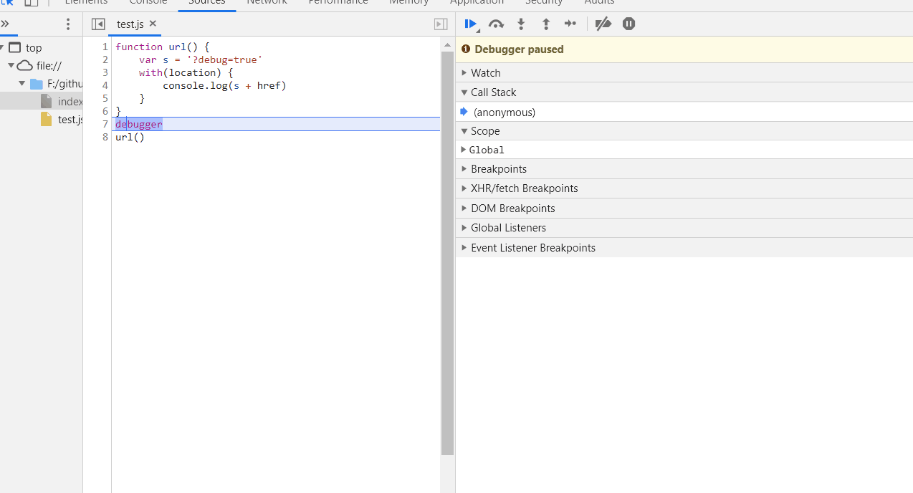

## 写在前面
大家都听说过`execution context（执行上下文或执行环境）`，在操作系统中也有类似的上下文概念，它指得是存储在各寄存器中的中间数据，还有context switchs（上下文切换）等概念，那js中的context跟os中的context相比，是不是也有异曲同工之妙呐？

>看个题目，试想下浏览器是如何执行这段代码？
```js
let a = 1
var b = 2
function jad() {
    var a = 2
    jdzw()
}
function jdzw() {
    console.log(a, b)
}
jad() //1 2
```
## 执行上下文
#### 相关的几个关键词

+ 执行栈（Execution Stack/Calling Stack）
+ 变量提升（Hoisting）
+ 作用域链（Scope Chain）
+ 闭包（Closure）
+ 词法环境（LexicalEnvironment）
+ 变量环境（VariableEnvironment）

<strong>首先要明确的是执行上下文跟作用域链是两个不同的概念</strong>

定义：执行上下文是一个"环境"的抽象概念，在这个“环境”中Javascript代码被分析和执行。任何代码在JavaScript中运行时，都是在执行上下文中运行的。
#### 上下文的类型
1. **全局执行上下文（global execution context）**
这就是我们通常所说的全局环境，这里所能访问的变量都挂载到一个global object上，在浏览器中就是window对象，在node中就是 global 对象。<strong>程序在执行时只会有一个全局上下文存在</strong>
2. **函数执行上下文（function execution context）**
每一个函数在调用执行时都会创建一个上下文，当函数上下文被创建时，按照执行顺序会被推到执行栈中（具体过程稍后会讲），这也就意味这程序执行过程中会有多个函数上下文，并且还伴随着上下文的销毁。
3. **eval函数执行上下文**
代码在eval函数执行时也会有自己的上下文，开发过程中并不常涉及到，仅作为一个类型了解。
## 执行栈
简单理解就是遵循 `LIFO` 的栈结构，结合图解和动图感受一下上述函数的执行过程，目前我们只需要关注图中call stack 和 scope下的内容即可,图片是在chrome调试下截取，[关于chrome调试工具使用可以参考](https://mp.weixin.qq.com/s/Q1VY4OX826kI-qGxVRz7HA)


具体的执行过程：
1. 当浏览器加载完成代码后，首先会创建global execution context推到栈中，
2. 当执行jad()时，会创建该函数的执行上下文，推到stack顶部；
3. 当遇到jdzw()时同样也是新建函数上下文，推到stack顶。
4. 每一个函数执行完后，会依次pop出自己的上下文，最终只会保留global 上下文。
5. 当程序执行完，浏览器页面关闭，全局上下文出栈并销毁。


## 上下文的生命周期
上图中我们发现它 scope 中存在 local 和 global 这两个变量，local 中保存有当前函数可以访问到的变量名，而 global 其实就是 window，保存全局的一些变量，这其实就是一个简单的作用域链。

<strong>上下文的生命周期分两个阶段：创建阶段和执行阶段</strong>
### 创建阶段
在这期间会创建 LexicalEnvironment 和 VariableEnvironment 两部分，用伪代码表示如下：
```js
ExecutionContext = {
  LexicalEnvironment: {},
  VariableEnvironment: {},
}
```
#### LexicalEnvironment是什么？

简单理解为是<strong>标识符-变量的映射（identifier-variable mapping）</strong>标识符指的是函数或变量的名称，变量指得是真正的引用对象或基本类型数据。它包含三个结构：
1. environment record（环境记录）
2. outer environment（外部的环境）
3. this（this的绑定）


#### environment record
对于 Environment Record，又分为 Declarative environment record（声明式环境记录）和Object environment record（对象式环境记录）两种，

<strong>声明式环境记录主要用在函数上下文中，包含变量、函数和 arguments 对象；相反对象式环境记录则用于全局上下文中，主要用于记录全局的对象，函数和变量。</strong>

#### outer environment
outer environment 指向外部的 LexicalEnvironment，这样可以获取到外部的数据。全局上下文的outer总是指向null。

#### this
this绑定依赖于函数的执行方式，全局环境中this指向global object。[关于this的理解推荐查看之前的文章](https://mp.weixin.qq.com/s/5XZeO0ifzuxidrC5hdpdJw)

#### VariableEnvironment又是什么？
其实它也是一种 LexicalEnvironment，只不过是用来保存用 var 声明的变量，与let、const声明的变量区分开。

举个例子🌰
```js
let a = 1
var b = 2
var h
function jad() {
    var c = 2
    let d = 3
    return c + d
}
h = jad(1，2)
```
上述代码的全局上线文创建过程如下：
```js
GlobalExectionContext = {
  LexicalEnvironment: {
    EnvironmentRecord: {
      Type: "Object", // 对象式环境记录用于全局上下文中
      a: <uninitialized>, // let声明在创建时期uninitialized
      jad: <function>
    }
    outer: <null>,
    this: <global object>
  },
  VariableEnvironment: {
    EnvironmentRecord: {
      Type: "Object",
      b: undefined, // var 声明undefined
      h: undefined
    }
    outer: <null>,
    this: <global object>
  }
}
```
jad 函数执行时，函数上下文的创建过程如下
```js
JadFunctionExectionContext = {
  LexicalEnvironment: {
    EnvironmentRecord: {
      Type: "Declarative", // 函数上下文的环境记录为Declarative类型
      d: <uninitialized>,
      Arguments: {0: 1, 1: 2, length: 2// 函数上下文包含Arguments对象
    }
    outer: <GlobalExectionContext>, // 指向上层上下文
    this: <global>
  },
  VariableEnvironment: {
    EnvironmentRecord: {
      Type: "Declarative",
      c: undefined,
    }
    outer: <GlobalExectionContext>,
    this: <global>
  }
}
```
可以观察到 let 声明的变量在创建过程中是未初始化的，而 var 声明的变量是 undefined，这也就是为什么在 var 之前访问变量会输出 undefined，而 let 会报错。这其实就是 var `变量提升` 和 let 的`TDZ（临时性死区）`，并且<strong>函数的变量提升优先级高，因此会出现变量覆盖，另外函数表达式并不会提升</strong>
>但如果在 let 声明之后访问，虽然没赋值，引擎也会默认undefined
```js
var a = 1
function a() {

}
var b = 2
var b = function(){}
if(true) {
    console.log(c) // ReferenceError: c is not defined
    let c
}
console.log(a, b) // 1 function
```
### 执行阶段
当进入执行阶段，上述代码的全局上下文会更新如下：
```js
GlobalExectionContext = {
  LexicalEnvironment: {
    EnvironmentRecord: {
      Type: "Object",
      a: 1, // 执行完 a = 1
      jad: <function>
    }
    outer: <null>,
    this: <global object>
  },
  VariableEnvironment: {
    EnvironmentRecord: {
      Type: "Object",
      b: 2, // 执行完 b =2
      h: undefined
    }
    outer: <null>,
    this: <global object>
  }
}
```
jad执行时，函数上下文的更新如下
```js
JadFunctionExectionContext = {
  LexicalEnvironment: {
    EnvironmentRecord: {
      Type: "Declarative", // 函数上下文的环境记录Declarative
      d: 3, // 执行let d = 3
      Arguments: {0: 1, 1: 2, length: 2
    }
    outer: <GlobalExectionContext>,
    this: <global>
  },
  VariableEnvironment: {
    EnvironmentRecord: {
      Type: "Declarative",
      c: 2, // 执行 var c = 2
    }
    outer: <GlobalExectionContext>,
    this: <global>
  }
}
```
当 `jad` 函数执行完后，将返回值更新到变量 `h`。

在ES6之前，上下文可以简单理解为下面这种结构：
+ vo：指的是变量对象(variable object)
+ ao：指的是活动对象(activation object)
+ 在创建过程到执行过程vo => ao,变量被激活赋值，同时还伴随着this的绑定及作用域链的创建
```js
// 上下文在创建阶段
Context = {
    vo: {
      a: undefined  // 各种变量 undefined
    },
    outer:<other context or null>
    this:<global or undefined>
}
// 上下文在执行阶段
Context = {
    ao: {
      a: 1  // 变量赋值
    },
    outer:<other context or null>
    this:<global or undefined>
}
```
## 作用域链
**作用域简单分为全局作用域，函数作用域和块级作用域**
```js
let a = 1
var b = 2 // 全局作用域
function jad() {
    var a = 2 // 函数作用域
    jdzw()
    if(true) { // 块级作用域
        let f = 3
        let a = 4
        console.log(f, a)// 3 4
    }
}
function jdzw() {
    console.log(a, b)// 1 2
}
jad() 
```


在上图中的scope看到的local global block等属性，这其实就是当前函数的作用域链。local其实可以理解为函数作用域。本质上是在执行上下文创建的过程中，<strong>outer指向的外部环境，这样就构成了类似链表式的结构，作用域链的终点始终是global object</strong>，在浏览器中也就是window对象。

作用域链保证了函数对执行环境有权访问的所有变量和函数的有序访问

## 延长作用域
js中的某些语句可以延长作用域链
+ try-catch的catch块
+ with语句
```js
function url() {
    var s = '?debug=true'
    with(location) {
        console.log(s + href)// 此处可以访问到href
    }
}
try {
    throw new Error('error')
} catch(err) { // catch并不是一个函数，执行到此处时 err被放到当前作用域链的最前端 
    console.log(err) // error
}
```

## 闭包
**闭包指的是有权访问另一个函数作用域中的变量的函数。**

闭包为什么能达到这样的效果？

究其原因是因为闭包函数定义在父级函数的内部，因此闭包函数的执行上下文在创建的过程中，自然将outer指向父级函数的执行上下文。

如下 `c` 函数就是一个闭包，当然创建的过程也可使用`匿名函数`
闭包这一特点可以用来`缓存数据`。比如`函数柯理化`等，也让函数执行过程变得复杂多变，这也是js作为弱语言吸引人的特点之一。❤️
```js
let a = 1
var b = 2
function jad() {
    var a = 2
    function jdzw() {
        console.log(a, b) //2 2 能够访问到jad中的a
    }
    return jdzw
}

let c = jad()
c() //2 2 能够访问到jad中的a
```
## 最后
>希望读完之后，能够对js的执行上下文，作用域，闭包及变量提升有所收获。（个人感觉跟os中的context的概念大同小异）
```js
let a = 'hello'
(function (callback) {
  let b = 'world'
  callback()
})(function () {
    console.log(a)
    console.log(b)
  })
// hello world or hello error?
```
## 参考文章
+ [js高级程序设计]()
+ [Understanding Execution Context and Execution Stack in Javascript](https://blog.bitsrc.io/understanding-execution-context-and-execution-stack-in-javascript-1c9ea8642dd0)
+ [执行上下文及其生命周期](https://www.jianshu.com/p/a6e8d2bf1ca0)
