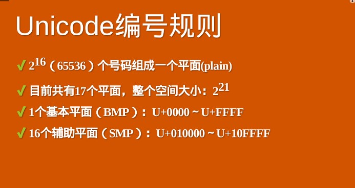
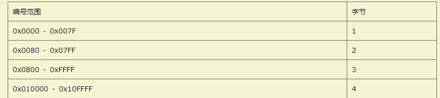
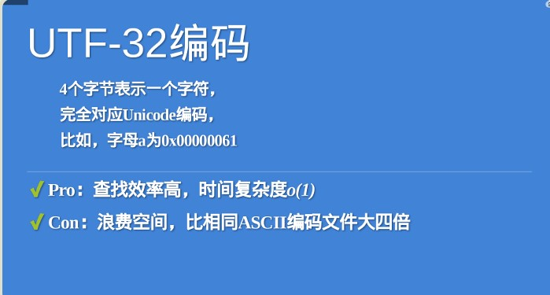
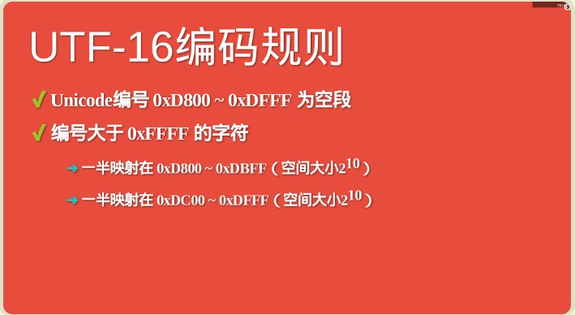

### 笔记参考
[阮一峰老师](http://www.ruanyifeng.com/blog/2014/12/unicode.html)
### Unicode字符集
简单说就是做了映射关系f(x)=字符，例如编号f(1)='a'，f(2)='b'，这个编号在规定中称为`code point(码点)`而utf-8，utf-16，utf-32分别是实现这种映射关系不同的编码方式


### utf-8

UTF-8是一种变长的编码方法，字符长度从1个字节到4个字节不等。


### utf-32
每个码点使用四个字节表示，字节内容一一对应码点。这种编码方法就叫做UTF-32



### utf-16
UTF-16的编码长度要么是2个字节（U+0000到U+FFFF），要么是4个字节（U+010000到U+10FFFF）。



由于unicode编号0xd800-0xdfff为空段，所以当遇到一个unicode编号大于0xffff的时候，比如0x010000,那么对应的四个字节的编码应该为0xd800 0xdc00

所以，当我们遇到两个字节，发现它的码点在U+D800到U+DBFF之间，就可以断定，紧跟在后面的两个字节的码点，应该在U+DC00到U+DFFF之间，这四个字节必须放在一起解读。

### javascript编码UCS-2

usc-2与tf16两者的关系简单说，就是UTF-16取代了UCS-2，或者说UCS-2整合进了UTF-16。所以，现在只有UTF-16，没有UCS-2。

由于JavaScript只能处理UCS-2编码，造成所有字符在这门语言中都是2个字节，如果是4个字节的字符，会当作两个双字节的字符处理。

### es6

1、正确识别字符

  ES6可以自动识别4字节的码点。因此，遍历字符串就简单多了。

  ```javascript
  for (let s of string ) {
    // ...
  }
  ```
  但是，为了保持兼容，length属性还是原来的行为方式。为了得到字符串的正确长度，可以用下面的方式。
  ```javascript
  Array.from(string).length
  ```
  2、码点表示法
  ```javascript
  '好' === '\u597D' // true
  '😀' === '\u1F600' // false
  '😀' === '\u{1F600}'
  ```
  3、正则表达式
  ES6提供了u修饰符，对正则表达式添加4字节码点的支持。
  ```javascript
  /./.test('😀') // true 认为长度为2的字符串
  /./u.test('😀') // true
  /^.$/.test('😀') // false
  /^.$/u.test('😀') //false
  ```