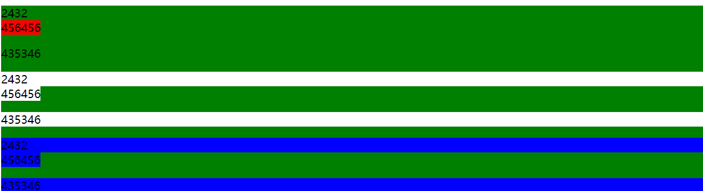

#### arguments 不能在箭头函数中访问
```js
function getDebounce(fn, time) {
      let th = null
      return (...res) => {
        clearTimeout(th)
        th = setTimeout(() => {
          fn.call(this, ...res)
        }, time)
      }
}

function getDebounce(fn, time) {
      let th = null
      return function() {
        clearTimeout(th)
        th = setTimeout(function() {
          fn.call(this, ...arguments)
        }, time)
      }
},

```

#### last-of-type nth-of-type()

先匹配到该选择器选中的dom类型的元素，再进一步比较该类型dom元素是否符合要求
```html
  <div class="parent">
    <div class="item">2432</div>
    <span class="item">456456</span>
    <p class="item">435346</p>
    <div class="item">2432</div>
    <span class="item">456456</span>
    <p class="item">435346</p>
    <div class="item">2432</div>
    <span class="item">456456</span>
    <p class="item">435346</p>
  </div>
```
```css 
.parent {
  background: yellowgreen;
}
.parent .item:last-child{
  background: red;
}
.parent .item:last-of-type{
  background: blue;
}
.parent .item:nth-of-type(2){
  background: white;
}
.parent .item:nth-child(2){
  background: red;
}
```

#### 柯里化
```js
function curry(fun) {
  let args = Array.prototype.slice.call(argements, 1)
  let _func = function() {
    if(argements.length === 0) {
      return fun.apply(this, args)
    }else {
      Array.prototype.push.apply(args, argements)
      return _func
    }
  }
  return _func
}
```
#### 利用apply简单实现bind
```js
Function.prototype.bind = function(context) {
  let _arg = Array.prototype.slice.apply(argements, 1)
  let _this = this
  return function() {
    Array.prototype.push.apply(_arg, Array.prototype.slice.apply(argements))
    _this.apply(context, _args)
  }
}
```
#### new 工作本质
```js
let b = new a()
// 相当于
let t = {}
let b = a.call(t)
b = b || t
```
#### redux compose js 解释
```js
 // 传入一个函数数组，返回一个函数 该函数是数组从右往左的compose
 // 该过程跟某一特定生产线类似，都是对同一产品的依次加工
 function compose(...funcs) {
  if (funcs.length === 0) {
    return arg => arg
  }

  if (funcs.length === 1) {
    return funcs[0]
  }
  // 执行到此处 length必然大于等于2 
  // 才能确保reduce函数正确执行 因为reduce 函数在数组为空时 必须穿一个默认值，否则会报错
  // 首先明确reduce的返回值 一定跟该数组中任意一项 同种数据结构
  // 比如 a.reduce((b, c) => b + c, 1) 该返回值 正常一定是 整数
  // 所以 return 语句返回值的一定是个函数
  // 如何达到 从右往左 执行的呐？
  // 关键在于 a(b(...args)) 倘若变成 b(a(...args))则是 从左往右
  return funcs.reduce((a, b) => (...args) => a(b(...args)))
}
```
#### 扁平化数组函数
```js
function flat(arr) {
  let a = []
  for(let item of arr) {
    if(Array.isArray(item)) {
      a.push(...flat(item))
    }else {
      a.push(item)
    }
  }
  retu
```
#### 排序
```js
function Qsort(arr, start, end) {//约定start end 总不会数组越界
  function solve(start, end) {// 该函数的作用就是 返回一个数组下标，同时数组中该下标的左边一定不大于它，右边一定不小于它
    let k = arr[start] // 我们选定arr[start] 作为参考值 为什么要选start为参考值？这是我个人习惯，参考值可以任意选择
    while (start < end) {// 为什么是< 不是 <= ? 我们需要循环终止时 一定是 start === end 
      while (arr[end] >= k && start < end) end-- //为什么是 >= k？快排并不是一个稳定的排序，所以我们找到一个小于k的值，并将它放到最左端就可以了
      arr[start] = arr[end]// 会不会把原先start位置的值 覆盖丢失掉？不会因为我们的值已经被保存在k或arr[end]中了
      while (arr[start] <= k && start < end) start++//找到一个大于k的值
      arr[end] = arr[start]// 并将它放到最左端，此时start的值 被保存在arr[end]不存在覆盖丢失
    }
    arr[start] = k // arr[end] = k 也是一样的，因为此处start === end 这里只需要将参考值放到它应该在的位置
    return start
  }
  if (start < end) {
    let m = solve(start, end)
    Qsort(arr, 0, m - 1)//将数组0 到 m - 1排序
    Qsort(arr, m + 1, end)//将数组m 到 end排序
  }
}

function bubbleSort(arr) {
  let start = 0, end = arr.length
  for(let i = end - 1; i >= 0; i--) {
    for(let j = start; j < i; j++) { // 将0 - i 中最大的值放到i中 就像气泡往上冒一样
      if(arr[j] > arr[j + 1]) {// 比较j j+1 保证j+1 不小于 j
        let a = arr[j]
        arr[j] = arr[j + 1]
        arr[j + 1] = a
      }
    }
  }
}
function selectSort(arr) {
  let start = 0, end = arr.length
  for(let i = start; i < end; i++) {
    let min = arr[i], key = i
    for(let j = i; j < end; j++) { // 选择 i - end中最小的值 将其放到第i位置上 也就是第i小的值放到i位置上
      if(min > arr[j]) {
        min = arr[j]
        key = j
      }
    }
    arr[key] = arr[i]
    arr[i] = min 
  }
}
```
#### css sticky
可以理解为距离top/left/right/bottom至少 n，否则由relative 变成 fixed
1. 须指定 top, right, bottom 或 left 四个阈值其中之一，才可使粘性定位生效。否则其行为与相对定位相同。
    + 并且 top 和 bottom 同时设置时，top 生效的优先级高，left 和 right 同时设置时，left 的优先级高。
2. 设定为 position:sticky 元素的任意父节点的 overflow 属性必须是 visible，否则 position:sticky 不会生效。这里需要解释一下：
    + 如果 position:sticky 元素的任意父节点定位设置为 overflow:hidden，则父容器无法进行滚动，所以 position:sticky 元素也不会有滚动然后固定的情况。
    + 如果 position:sticky 元素的任意父节点定位设置为 position:relative | absolute | fixed，则元素相对父元素进行定位，而不会相对 viewprot 定位。
3. 达到设定的阀值。这个还算好理解，也就是设定了 position:sticky 的元素表现为 relative 还是 fixed 是根据元素是否达到设定了的阈值决定的。
#### bfc
+ 根元素
+ float属性不为none
+ position为absolute或fixed
+ display为inline-block, table-cell, table-caption, flex, inline-flex
+ overflow不为visible
#### NodeList HTMLCollection Array
> myNodeList --> NodeList.prototype --> Object.prototype --> null

> myArray --> Array.prototype --> Object.prototype --> null
+ NodeList 对象是一个节点的集合，是由 Node.childNodes 和 document.querySelectorAll 返回的.
  + 在一些情况下，NodeList 对象是一个实时集合，也就是说，如果文档中的节点树发生变化，则已经存在的实时 NodeList 对象也会随之变化。例如，Node.childNodes 是实时的.在其他情况下，NodeList 是一个静态集合，也就意味着随后对文档对象模型的任何改动都不会影响集合的内容。比如document.querySelectorAll 就会返回一个静态的 NodeList。
    ```js
    var parent = document.getElementById('parent');
    var child_nodes = parent.childNodes;
    console.log(child_nodes.length); // 我们假设结果会是“2”
    parent.appendChild(document.createElement('div'));
    console.log(child_nodes.length); // 但此时的输出是“3”
    ```
+ HTML DOM 中的 HTMLCollection 是即时更新的（live）；当其所包含的文档结构发生改变时，它会自动更新。
    ```js
    var elem1, elem2;

    // document.forms 是一个 HTMLCollection

    elem1 = document.forms[0];
    elem2 = document.forms.item(0);

    alert(elem1 === elem2); // 显示 "true"

    elem1 = document.forms["myForm"];
    elem2 = document.forms.namedItem("myForm");

    alert(elem1 === elem2); // 显示 "true"
    ```
    返回类型浏览器不同实现不同，仅供参考
    |api|返回值|特性|
    |---|---|---|
    |getElementById|`Element`|-|
    |getElementsByClassName|`HTMLCollection `|实时更新|
    |getElementsByName|`NodeList`|实时更新|
    |getElementsByTagName|`HTMLCollection`|实时更新|
    |querySelector|`Element`|-|
    |querySelectorAll|`NodeList`|不实时更新|
    ```js
    var select = document.querySelector('.select');
    var inner = select.querySelectorAll('.outer .inner')
    var s = document.getElementsByClassName('red test');//获取所有 class 同时包括 'red' 和 'test' 的元素.
    var div2Paras = div2.getElementsByTagName("p");
    ```

Document -> Node -> EventTarget
Element -> Node -> EventTarget

#### 关于执行顺序
```js
async function async1(){
  await async2()
  console.log('async1 end')
}
async function async2(){} 
async1();
new Promise(function(resolve){
  resolve();
}).then(function(){
  console.log('promise2')
}).then(function() {
  console.log('promise3')
}).then(function() {
  console.log('promise4')
})
```
其中
```js
async function async1(){
  await async2()
  console.log('async1 end')
}
//等价于
async function async1() {
  return new Promise(resolve => {
    resolve(async2())
  }).then(() => {
    console.log('async1 end')
  })
}
```
> 因为 resolve(async2()) 并不等于 Promise.resolve(async2()) 因为 async2() 返回一个 promise, 是一个 thenable 对象，resolve(thenable) 并不等于 Promise.resolve(thenable) ，而 resolve(non-thenable) 等价于 Promise.resolve(non-thenable)，具体对照规范的解释请戳

resolve(thenable) 和 Promise.resolve(thenable) 的转换关系是这样的
[why](https://stackoverflow.com/questions/53894038/whats-the-difference-between-resolvethenable-and-resolvenon-thenable-object)
```js
new Promise(resolve=>{
  resolve(thenable)
})
// 或变成
new Promise(resolve => {
  Promise.resolve().then(() => {
    thenable.then(resolve)
  })
})
```
所以题目等价于
```js
async function async1 () {
  return new Promise(resolve => {
    Promise.resolve().then(() => {
      async2().then(resolve)
    })
  }).then(() => {
    console.log('async1 end')
  })
}
async function async2 () {}
async1()
Promise.resolve()
  .then(function () {
    console.log('promise2')
  })
  .then(function () {
    console.log('promise3')
  })
  .then(function () {
    console.log('promise4')
  })
  //promise2 promise3 async1 end promise4
```
#### mouseover mouseout/ mouseenter，mouseleave
mouseover 和 mouseout 在鼠标移入移出时会触发其父级元素的 mouseover，mouseout 方法，而 mouseenter，mouseleave 只会触发当前鼠标移入和移出元素的方法。换句话说，后两者是不冒泡的事件，前两者是会冒泡的事件。
#### css 优先级
1、内联样式 > ID 选择器 > 类选择器 = 属性选择器 = 伪类选择器 > 标签选择器 = 伪元素选择器

2、计算选择符中 ID 选择器的个数（a），计算选择符中类选择器、属性选择器以及伪类选择器的个数之和（b），计算选择符中标签选择器和伪元素选择器的个数之和（c）。按 a、b、c 的顺序依次比较大小，大的则优先级高，相等则比较下一个。若最后两个的选择符中 a、b、c 都相等，则按照"就近原则"来判断。

3、属性后插有 !important 的属性拥有最高优先级。若同时插有 !important，则再利用规则 1、2 判断优先级
#### repaint reflow
>触发reflow

页面首次渲染
浏览器窗口大小发生改变
元素尺寸或位置发生改变
元素内容变化（文字数量或图片大小等等）
元素字体大小变化
添加或者删除可见的DOM元素
激活CSS伪类（例如：:hover）
查询某些属性或调用某些方法
>触发repaint

color、background-color、visibility

>避免

避免使用table布局。
尽可能在DOM树的最末端改变class。
避免设置多层内联样式。
将动画效果应用到position属性为absolute或fixed的元素上。
避免使用CSS表达式（例如：calc()）。
#### 图片格式对比
jpg：有损压缩，多次编辑保存后图像可能会失真
png：无损压缩，支持透明背景，文件通常较大
gif：只支持256种颜色，支持动图。
#### clone
```js
function deepCloneSample(target) {
    let source = {}
    let targetQueue = [target], copyQueue = [source], visitedTarget = [], visitedCopy = []
    while (targetQueue.length > 0) {
        let t = targetQueue.shift()
        let c = copyQueue.shift()
        visitedTarget.push(t)
        visitedCopy.push(c)
        for (let key in t) {
            if (typeof t[key] !== 'object') {
                c[key] = t[key]
            } else {
                let index = visitedTarget.indexOf(t[key])
                if (index >= 0) {
                    c[key] = visitedCopy[index]
                } else {
                    c[key] = {}
                    copyQueue.push(c[key])
                    targetQueue.push(t[key])
                }
            }
        }
    }
    return source
}
```
#### 状态码
301：重定向
302：临时性重定向
400：请求错误
401：权限
403：禁止
502：端口错误
504：访问超时
#### 移动端适配
[参考链接](https://juejin.im/post/5c0dd7ac6fb9a049c43d7edc)

|名词|解释|获取|
|---|---|---|
|layoutviewport|布局视口|`document.documentElement.clientWidth`|
|visualviewport|显示视口|`window.innerWidth`|
|idealviewport|理想视口|`screen.width`|
```js
<meta name='viewport' content='width=device-width,initial-scale=1,user-scale=no' />
```
+ width 设置的是 layoutviewport 的宽度
+ initial-scale 设置页面的初始缩放值，并且这个初始缩放值是相对于 idealviewport 缩放的，最终得到的结果不仅会决定 visualviewport，还会影响到 layoutviewport
+ user-scalable 是否允许用户进行缩放的设置
+ device-width 的值就是理想视口的宽度
```js
// 设定两个变量：  
viewport_1 = width;  
visualviewport = idealviewport / initial-scale;

// 则： 
layoutviewport = max{viewport_1, visualviewport};

```
只要 layoutviewport === visualviewport，页面下面不会出现滚动条，默认只是把页面放大或缩小。

#### 对象继承
```js
/// 寄生组合方式
function MyClass() {
     SuperClass.call(this);
     OtherSuperClass.call(this);
}

// 继承一个类
MyClass.prototype = Object.create(SuperClass.prototype);
// 混合其它
Object.assign(MyClass.prototype, OtherSuperClass.prototype);
// 重新指定constructor
MyClass.prototype.constructor = MyClass;

MyClass.prototype.myMethod = function() {
     // do a thing
};

// 构造函数方式
function MyClass() {
  SuperClass.call(this)
}
// 原型链方式
function SuperClass() {

}
function MyClass() {

}
MyClass.prototype = new SuperClass()
MyClass.prototype.constructor = MyClass
// 组合方式
function MyClass() {
 SuperClass.call(this)
}
MyClass.prototype = Object.create(SuperClass.prototype, { constructor: { value: MyClass, writable: true, configurable: true } })
```
#### 数字精度
0.1 + 0.2 === 0.3

>parseFloat((0.1 + 0.2).toFixed(10))
#### 页面错误捕捉
+ onerror
+ unhandledrejection
+ promise 同步错误导致 promise 状态变更为rejected 会触发.catch或then失败方法，如果没有捕捉，会产生unhandledrejection；异步错误如果调用了reject函数 则promise状态变更，否则报错出发onerro
+ try catch不能捕获里边的异步函数
#### 浏览器数据存储
+ cookie
+ sessionStorage
+ localStorage
+ indexDB
#### 原型链理解
```js
function people() {

}
console.log(Object.getPrototypeOf(people) === people.__proto__) // true
console.log(people.__proto__ === Function.prototype)// true
console.log(Object.prototype === Function.prototype.__proto__)// true
console.log(Object.prototype.__proto__, Function.prototype.__proto__)// null {}
let a = {}
console.log(a.__proto__ === Object.prototype)// true
let b = Object.create(null)
console.log(b.__proto__)// undefined
```
#### 基础知识
```js
let a ="",b = new String('34'), c = String('445')
console.log(typeof a) //string
console.log(typeof b) //object
console.log(typeof c) //string
console.log(a instanceof String) // false
console.log(b instanceof String)// true
console.log(c instanceof String)// false

console.log({} == []) // false
console.log(0 == Number('')) // true Number() == Number('') == 0
```
#### event loop
```js
setTimeout(()=>{
    console.log('timer1')

    Promise.resolve().then(function() {
        console.log('promise1')
    })
}, 0)

setTimeout(()=>{
    console.log('timer2')

    Promise.resolve().then(function() {
        console.log('promise2')
    })
    setTimeout(() => {
    	console.log('timer3')
    }, 0)
}, 0)

Promise.resolve().then(function() {
    console.log('promise3')
})

console.log('start')
```
浏览器中 start promise3 timer1 promise1 timer2 promise2 timer3

1. 执行完主执行线程中的任务。
2. 取出Microtask Queue中任务执行直到清空。
3. 取出Macrotask Queue中一个任务执行。
4. 取出Microtask Queue中任务执行直到清空。
5. 重复3和4

node中 start promise3 timer1 timer2 promise1 promise2 timer3

+ timers 阶段: 这个阶段执行setTimeout和setInterval预定的callback;
+ I/O callbacks 阶段: 执行除了 close事件的callbacks、被timers设定的callbacks、setImmediate()设定的callbacks这些之外的callbacks;
+ idle, prepare 阶段: 仅node内部使用;
+ poll 阶段: 获取新的I/O事件, 适当的条件下node将阻塞在这里;
+ check 阶段: 执行setImmediate() 设定的callbacks;
+ close callbacks 阶段: 执行socket.on('close', ...)这些 callback

清空当前循环内的Timers Queue，清空NextTick Queue，清空Microtask Queue。
清空当前循环内的I/O Queue，清空NextTick Queue，清空Microtask Queue。
清空当前循环内的Check Queu，清空NextTick Queue，清空Microtask Queue。
清空当前循环内的Close Queu，清空NextTick Queue，清空Microtask Queue。
进入下轮循环
>nextTick优先级比promise等microtask高。setTimeout和setInterval优先级比setImmediate高

setTimeout(fn,0) Vs setImmediate
+ 如果两者都在主模块（main module）调用，那么执行先后取决于进程性能，即随机
+ 如果两者都不在主模块调用（即在一个 IO circle 中调用），那么setImmediate的回调永远先执行
#### 快手面试
```js
//--------1--------
let a = {n: 1};
let b = a;
a.x = a = {n: 1}
console.log(a)
console.log(b)

//---------2------
Function.prototype.a = () => console.log(1)
Object.prototype.b = () => console.log(2)
function people() {

}
let p = new people()
p.a()
p.b()

//-------3---------
var x = 10
function pa(y) {
    var x = 30
    return pb(y)
}
function pb(y) {
    return x + y
}
console.log(pa(20))
```
#### 关于对象
函数对象的定义是：具有 [[call]] 私有字段的对象，构造器对象的定义是：具有私有字段
[[construct]] 的对象。
```js
function cls(a){
 this.a = a;
 return {
 getValue:() => this.a
 }
}
var o = new cls(100);
o.getValue(); //100
function cls(a) {
    this.a = a;
    return {
        getValue: function () {
            return this.a
        }
    }
}
var p = new cls(11);
console.log(p.getValue()); 
```
TypeError x is not a constructor
```js
new Math();
// TypeError: Math is not a constructor

new Symbol();
// TypeError: Symbol is not a constructor

function* f() {};
var obj = new f;
// TypeError: f is not a constructor
```
#### 属性便利
ES6 一共有 5 种方法可以遍历对象的属性。

（1）for...in

for...in循环遍历对象自身的和继承的可枚举属性（不含 Symbol 属性）。

（2）Object.keys(obj)

Object.keys返回一个数组，包括对象自身的（不含继承的）所有可枚举属性（不含 Symbol 属性）的键名。

（3）Object.getOwnPropertyNames(obj)

Object.getOwnPropertyNames返回一个数组，包含对象自身的所有属性（不含 Symbol 属性，但是包括不可枚举属性）的键名。

（4）Object.getOwnPropertySymbols(obj)

Object.getOwnPropertySymbols返回一个数组，包含对象自身的所有 Symbol 属性的键名。

（5）Reflect.ownKeys(obj)

Reflect.ownKeys返回一个数组，包含对象自身的所有键名，不管键名是 Symbol 或字符串，也不管是否可枚举。
#### 完整的bind 垫片
```js
Function.prototype.bind(context) {
    var arg = [].slice.call(arguments, 1)
    var source = this
    function bound() {
        if(this instanceof bound) {// 因为new的第一步是先挂在prototype 第二部call(this) 可以用来类型判断
            var pro = Object.create(source.prototype)
            var result = source.apply(pro, arg.concat([].slice.call(arguments)))
            return result && (typeof result === 'object') ? result : pro
        }
        return source.apply(context, arg.concat([].slice.call(arguments)))
    }
    return bound
}
```
#### 作用域
```js
function test() {
    var b = 2
    if(true) {
        var c = 1
        var b = 3
        let e = 2
    }
    console.log(b)
    console.log(c)
    console.log(d)
    var d = 23
    console.log(d)
    console.log(e)
}
```